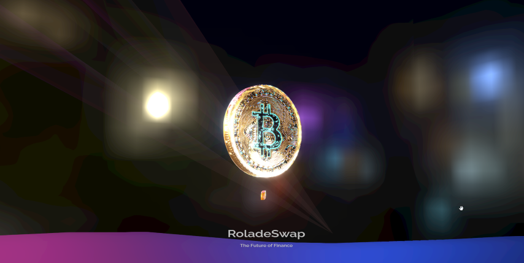
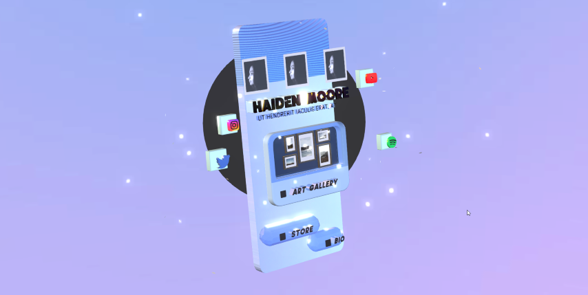

# xyz3d.js

A Three.js framework for easy 3d websites and 3d landing pages. Includes a blender plugin and works on mobile, has built in post-effects, is screen size responsive, highly optimized, built in raycasting, animations, & more!

## Intro

https://www.youtube.com/watch?v=3TKJ34WUUyA

<div  align="center">
  
  
  
</div>

## Features:

- Responsive to display size!
- Animated GLTF support (including light export!)
- Animate your objects in blender and have them fired on events like: "onClick, onHover" or simply played on loop
- Clickable models that open iframe or popup window
- JSON file for scene configuration and loading dynamic lights/hdr environments
- Custom Blender plugin for rapid development
- Smooth 3D scene navigation with JS APIs - "xyz3d.gotoSceneZone('HomePage')"
- Built in post processing
- Mobile devices supported + gryo based movement
- Built in fallback method for legacy devices

## Blender plugin

[xyz3d.js-blender-plugin](https://github.com/64blit/xyz3d.js-blender-plugin)

## Quick Start

```javascript
import { THREE, XYZ3d } from 'https://unpkg.com/xyz3d/dist/xyz3d.js'

const xyzed = new XYZ3d({
  jsonPath: 'assets/scene.json',
  domElements: {
    canvasID: 'main-canvas',
    iframe: 'popup-content',
    loadingScreenID: 'loading-screen'
  },
  camera: {
    fov: 30,
    postEffects: {
      bloom: {
        enabled: false,
        exposure: 1.1,
        threshold: 0.1,
        strength: 2,
        radius: 1
      }
    }
  }
})

xyzed.setup()
```

```json
{
  "models": [
    {
      "id": "test 1",
      "enabled": true,
      "path": "assets/models/city_model.glb",
      "position": {
        "x": 0,
        "y": 0,
        "z": 0
      },
      "scale": {
        "x": 1,
        "y": 1,
        "z": 1
      },
      "rotation": {
        "x": 0,
        "y": 0,
        "z": 0,
        "w": 0
      },
      "shadow": true,
      "shadowBias": 0.0005,
      "shadowNormalBias": 0.01,
      "shadowRadius": 4.0,
      "frustumCulled": true,
      "interactables": []
    }
  ],
  "lights": []
}
```

### All JSON Options

```json
{
	"models": [
		{
			"id": "test 1",
			"enabled": true,
			"path": "assets/models/city_model.glb",
			"position": {
				"x": 0,
				"y": 0,
				"z": 0
			},
			"scale": {
				"x": 1,
				"y": 1,
				"z": 1
			},
			"rotation": { , "//comment_rotation": "quaternion rotation",
				"x": 0,
				"y": 0,
				"z": 0,
				"w": 0
			},
			"shadow": true, "//comment_shadow": "sets both castShadow and receiveShadow to this value",
			"shadowBias": 0.0005,
			"shadowNormalBias": 0.01,
			"shadowRadius": 4.0,
			"frustumCulled": true,
			"interactables": [  , "//comment_interactables": "Assign interaction types here",
				{
					"type": "link", "//comment_link": "When the listed model (under modelName) is clicked it's animations will play, then the link inside 'content' will be opened in a new tab",
					"modelName": "ModelNameGoesHere",
					"content": "https://www.ebay.com"
				},
				{
					"type": "popup" , "//comment_popup": "When the listed model (under modelName) is clicked it's animations will play, then the html dom object contained in the domeElements.popup will have the class .XYZ3d-hidden replaced with .XYZ3d-visible",
					"modelName": "ModelNameGoesHere",
					"content": "pages/about.html"
				},
				{
					"type": "goToNextZone", "//comment_goToNextZone": "When the model is clicked, the camera move to the zoneIndex incremented by the 'content' amount",
					"modelName": "ModelNameGoesHere",
					"conent": "1" , "//comment_content": "This value can be negative, it's the number of zones to change based on the zone index."
				},
				{
					"type": "goToZone",
					"modelName": "ModelNameGoesHere",
					"conent": "LandingZone"
				}
			]
		}
	],
	"lights": [ , "//comment_lights": "Lights here are optional, lights inside the gltf file are automatically imported into the scene"
		{
			"id": "bg hdr",
			"type": "hdr",
			"enabled": true,
			"path": "assets/textures/4k.hdr",
			"backgroundIntensity": 1,
			"backgroundBlurriness": 0
		},
		{
			"id": "bg exr",
			"type": "exr",
			"enabled": true,
			"path": "assets/textures/4k.exr",
			"backgroundIntensity": 1,
			"backgroundBlurriness": 0
		},
		{
			"id": "point light 1",
			"type": "pointLight",
			"enabled": true,
			"position": {
				"x": 0,
				"y": 0.25,
				"z": 0
			},
			"color": "#FFFF00",
			"intensity": 1,
			"size": 100,
			"castShadow": false
		},
		{
			"id": "ambient light 1",
			"type": "ambientLight",
			"enabled": true,
			"color": "#FFFFFF",
			"intensity": 1.0
		},
		{
			"id": "dir light 1",
			"type": "directionalLight",
			"enabled": true,
			"position": {
				"x": 10,
				"y": 10,
				"z": 10
			},
			"target": {
				"x": 0,
				"y": 0,
				"z": 0
			},
			"color": "#FFFFFF",
			"intensity": 1,
			"castShadow": false
		}
	]
}
```
<!-- Generated by documentation.js. Update this documentation by updating the source code. -->

### Table of Contents

*   [XYZ3d][1]
    *   [Parameters][2]
    *   [Examples][3]
*   [gotoSceneZone][4]
    *   [Parameters][5]
    *   [Examples][6]
*   [nextSceneZone][7]
    *   [Parameters][8]
    *   [Examples][9]
*   [setup][10]
    *   [Examples][11]
*   [reset][12]
    *   [Examples][13]
*   [onPointerDown][14]
    *   [Parameters][15]
    *   [Examples][16]
*   [onHoverOver][17]
    *   [Parameters][18]
    *   [Examples][19]
*   [onHoverOff][20]
    *   [Parameters][21]
    *   [Examples][22]
*   [onSwipeUp][23]
    *   [Examples][24]
*   [onSwipeDown][25]
    *   [Examples][26]
*   [onUpdate][27]
    *   [Parameters][28]
    *   [Examples][29]
*   [onProgressLoading][30]
    *   [Parameters][31]
    *   [Examples][32]

## XYZ3d

Creates an instance of XYZ3d, a helper framework for 3D websites.

### Parameters

*   `config` **[Object][33]** The configuration object for the XYZ3d instance.

    *   `config.debug` **[Boolean][34]** Enables or disables debugging mode. Defaults to false.
    *   `config.jsonPath` **[String][35]** The path to the 3D scene created with the corresponding plugin.
    *   `config.domElements` **[Object][33]** The IDs of the HTML elements used to link the Three.js components.

        *   `config.domElements.canvas` **[String][35]** The rendering canvas.
        *   `config.domElements.popup` **[String][35]** The content popup.
    *   `config.camera` **[Object][33]** The configuration object for the camera.

        *   `config.camera.orbit` **[Boolean][34]** Enables or disables orbit camera controls. When enabled, gyro and followMouse are disabled automatically. Defaults to false.
        *   `config.camera.cameraShiftAmount` **[Number][36]** Controls the intensity of X/Y camera movement when orbit is off. Defaults to 0.05.
        *   `config.camera.followMouse` **[Boolean][34]** Enables or disables camera movement based on hovering pointer position, only for desktop. Defaults to true.
        *   `config.camera.gyro` **[Boolean][34]** Enables or disables camera movement based on gyroscope movement, only for mobile. Defaults to true.
        *   `config.camera.gyroScale` **[Boolean][34]** Scales the gyroscope movement of the camera, only for mobile. Defaults to 20.
        *   `config.camera.fov` **[Number][36]** Controls camera field of view. Defaults to 30.
        *   `config.camera.cameraSmoothTime` **[Number][36]** Controls camera movement time in seconds. Defaults to 0.25.
        *   `config.camera.cameraFramePadding` **[Number][36]** Controls the amount of padding from the interactable elements to the sides of the display, to ensure all interactables of the current zone are always in frame. Defaults to 1.
        *   `config.camera.postEffects` **[Object][33]** The configuration object for post effects.

            *   `config.camera.postEffects.enabled` **[Boolean][34]** Enables or disables post effects. Defaults to true.
            *   `config.camera.postEffects.bloom` **[Object][33]** The configuration object for bloom post effects.

                *   `config.camera.postEffects.bloom.enabled` **[Boolean][34]** Enables or disables bloom post effects. Defaults to true.
                *   `config.camera.postEffects.bloom.exposure` **[Number][36]** Controls bloom post effects exposure. Defaults to 1.1.
                *   `config.camera.postEffects.bloom.threshold` **[Number][36]** Controls bloom post effects threshold. Defaults to 0.1.
                *   `config.camera.postEffects.bloom.strength` **[Number][36]** Controls bloom post effects strength. Defaults to 1.
                *   `config.camera.postEffects.bloom.radius` **[Number][36]** Controls bloom post effects radius. Defaults to 1.
            *   `config.camera.postEffects.antialias` **[Boolean][34]** Enables or disables antialiasing post effects. Defaults to true.

### Examples

```javascript
const xyzed = new XYZ3d({
	jsonPath: 'scene.json',
	domElements: {
		canvas: 'main-canvas',
		popup: 'popup-content',
	}
})
```

## gotoSceneZone

This function moves the camera to a scene zone with the given name. The scene zones correspond to different pages in a website or application. The dampSpeed parameter controls the speed at which the camera moves to the new zone.

### Parameters

*   `name` **[String][35]** *   The name of the scene zone to move to, this is defined inside the blender plugin.
*   `dampTime` **[number][36]** The speed at which the camera lerps to the new zone. defaults to 0.1 seconds

### Examples

```javascript
XYZ3d.gotoSceneZone('About')
```

## nextSceneZone

### Parameters

*   `increment` **[Number][36]** the incremental value to move scene zones by, value can be negative or positive. Defaults to 1. (optional, default `1`)
*   `dampTime` **[number][36]** The speed at which the camera lerps to the new zone. defaults to 0.1 seconds (optional, default `null`)

### Examples

```javascript
XYZ3d.nextSceneZone()
```

## setup

### Examples

```javascript
XYZ3d.setup()
```

## reset

### Examples

```javascript
XYZ3d.reset()
```

## onPointerDown

### Parameters

*   `eventData` **[object][33]** The intersected 3d model and corresponding html content

### Examples

```javascript
XYZ3d.onPointerDown = (event) => { console.log(event) }
```

## onHoverOver

### Parameters

*   `eventData` **[object][33]** The intersected 3d model and corresponding html content

### Examples

```javascript
XYZ3d.onHoverOver = (event) => { console.log(event) }
```

## onHoverOff

### Parameters

*   `eventData` **[object][33]** The intersected 3d model and corresponding html content

### Examples

```javascript
XYZ3d.onHoverOff = (event) => { console.log(event) }
```

## onSwipeUp

### Examples

```javascript
XYZ3d.onSwipeUp = () => { console.log('Swipe up detected') }
```

## onSwipeDown

### Examples

```javascript
XYZ3d.onSwipeDown = () => { console.log('Swipe down detected') }
```

## onUpdate

### Parameters

*   `deltaTime` **[number][36]** The time the previous frame took in seconds.

### Examples

```javascript
XYZ3d.onUpdate = (deltaTime) => { console.log(deltaTime) }
```

## onProgressLoading

### Parameters

*   `step` **[number][36]** The model index being loaded.
*   `steps` **[number][36]** The total models to be loaded.
*   `percent` **[number][36]** The percentage loaded of the current model.

### Examples

```javascript
XYZ3d.onProgressLoading = (step, steps, percent) => { console.log(step, steps, percent) }
```

[1]: #xyz3d

[2]: #parameters

[3]: #examples

[4]: #gotoscenezone

[5]: #parameters-1

[6]: #examples-1

[7]: #nextscenezone

[8]: #parameters-2

[9]: #examples-2

[10]: #setup

[11]: #examples-3

[12]: #reset

[13]: #examples-4

[14]: #onpointerdown

[15]: #parameters-3

[16]: #examples-5

[17]: #onhoverover

[18]: #parameters-4

[19]: #examples-6

[20]: #onhoveroff

[21]: #parameters-5

[22]: #examples-7

[23]: #onswipeup

[24]: #examples-8

[25]: #onswipedown

[26]: #examples-9

[27]: #onupdate

[28]: #parameters-6

[29]: #examples-10

[30]: #onprogressloading

[31]: #parameters-7

[32]: #examples-11

[33]: https://developer.mozilla.org/docs/Web/JavaScript/Reference/Global_Objects/Object

[34]: https://developer.mozilla.org/docs/Web/JavaScript/Reference/Global_Objects/Boolean

[35]: https://developer.mozilla.org/docs/Web/JavaScript/Reference/Global_Objects/String

[36]: https://developer.mozilla.org/docs/Web/JavaScript/Reference/Global_Objects/Number
